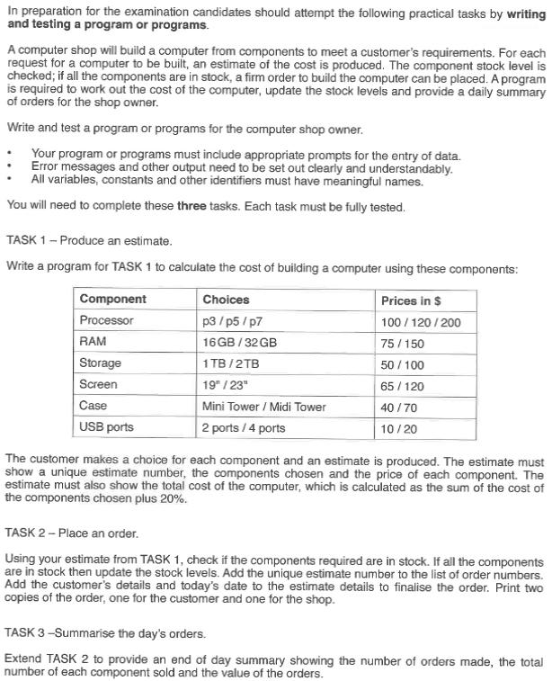

# Work for Cambridge Computer Science IGCSE

This repository is aimed at collating work related to [the course](http://www.cambridgeinternational.org/programmes-and-qualifications/cambridge-igcse-computer-science-0478/).
For example, I hope to write solutions to the pre release in a couple of different languages to develop my understanding of the task.
What we are expected to learn as part of this course is outlined in [the specification](http://www.cambridgeinternational.org/images/203951-2017-2019-syllabus.pdf).

An important quote from the spec - concerning Paper 2.

>There is some examining of knowledge with understanding, but most of the credit is for using
techniques and skills to solve problems. The examination questions require candidates to have
practical programming experience, including writing their own programs, executing (running), testing
and debugging them. **Knowledge of programming language syntax is not examined; in all cases the
logic is more important than the syntax.**

---

The Pre-release for 2018 is seen below.

